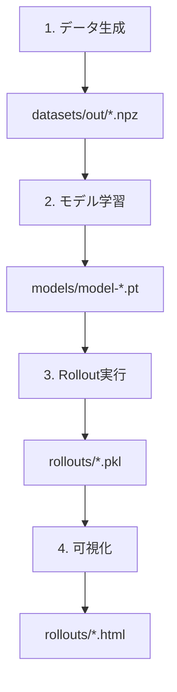

# GNS プロジェクト実行ガイド

このガイドでは、学習データの生成から学習、rollout までの一連の実行方法を説明します。

## 目次

1. [環境セットアップ](#1-環境セットアップ)
2. [学習データの生成](#2-学習データの生成)
3. [モデルの学習](#3-モデルの学習)
4. [Rollout（推論）の実行](#4-rollout推論の実行)
5. [可視化と結果の確認](#5-可視化と結果の確認)

---

## 1. 環境セットアップ

このプロジェクトは`uv`を使用してパッケージを管理しています。

### 必要なツール

- Python 3.10 以上
- uv（パッケージマネージャー）
- CUDA 対応 GPU（推奨、CPU でも動作可能）

### 依存パッケージのインストール

```bash
# uvを使って依存パッケージをインストール
uv sync
```

---

## 2. 学習データの生成

### 2.1 データ生成スクリプトの実行

学習データは`pymunk`物理エンジンを使用して生成します。

```bash
# データ生成スクリプトを実行
uv run python datasets/scripts/gen_pymunk.py
```

学習と同様に、データ生成の設定値は`datasets/config.yaml`で管理します。スクリプトを直接編集せず、この設定ファイルを変更して粒子密度や出力先を調整してください。

### 2.2 生成されるデータ

実行すると、以下のファイルが`datasets/out/`ディレクトリに生成されます:

- **train.npz**: 訓練データ（デフォルト 1000 シーン）
- **valid.npz**: 検証データ（デフォルト 100 シーン）
- **metadata.json**: データセットのメタ情報（速度・加速度の統計、接続半径など）
- **train/scene\_\*.npz**: 個別シーンのデータ（オプショナル）
- **valid/scene\_\*.npz**: 個別シーンのデータ（オプショナル）

### 2.3 データ生成のカスタマイズ

カスタマイズは`datasets/config.yaml`で行います。主な項目は以下の通りです:

- `num_train_scenes` / `num_valid_scenes`: 生成するシーン数
- `timesteps`, `dt`, `substeps`: シミュレーションの時間分解能
- `rigid_count_range`: シーン内の剛体数（最小値・最大値）
- `particle_density`: 剛体の内部まで含めた粒子密度（大きくすると粒子間隔が狭くなり全体が高密度になります）
- `wall_density_scale`: 壁（線分）だけ密度を増減させたい場合の倍率
- `visualization_marker_scale`: アニメーションや推論可視化時のマーカーサイズ倍率（大きすぎて潰れる場合は 0.5 などに下げる）
- `output_dir`: 生成データの保存先

剛体の内部も自動的に粒子で満たされるようになっているため、`particle_density`を調整するだけで全体の粒子数を一括でコントロールできます。密度を上げるとファイルサイズと生成時間も増えるため、バランスを見ながら設定してください。

### 2.4 データの内容

各シーンには以下が含まれます:

- **剛体オブジェクト**: ランダムな形状（箱または円）が落下
- **壁**: 床、左壁、右壁（STATIC ボディとして固定）
- **物理パラメータ**: 質量、摩擦、反発係数などがランダム化

---

## 3. モデルの学習

### 3.1 設定ファイルの確認

学習設定は`config.yaml`で管理されています:

```yaml
mode: train
data_path: ./datasets/out/
model_path: ./models/
tensorboard_log_dir: null      # nullなら model_path/tb を使用
tensorboard_port: null         # 任意のポートに自動割当
tensorboard_host: null         # デフォルトは 127.0.0.1
batch_size: 2
noise_std: 0.00067
ntraining_steps: 100 # 学習ステップ数
validation_interval: null # 検証間隔（nullで無効）
nsave_steps: 50 # モデル保存間隔
log_interval: 10           # 何ステップごとに軽量ログを出力するか
tensorboard_interval: 10   # TensorBoard に書き込むステップ間隔(null で log_interval と同じ)
rollout_interval: null        # ロールアウト評価を無効化したい場合は null
rollout_max_examples: 1       # 評価に使うサンプル数
rollout_dataset: null         # null は valid/test/train の順で自動選択
train_dataset_fraction: null  # 学習データを一部のみ使う場合は 0-1 の値を設定
valid_dataset_fraction: null  # 検証データを一部のみ使う場合は 0-1 の値を設定
train_dataset_count: null     # 学習データの使用件数を直接指定（優先度: count > fraction）
valid_dataset_count: null     # 検証データの使用件数を直接指定（優先度: count > fraction）
lr_init: 0.0001 # 初期学習率
lr_decay: 0.1 # 学習率減衰率
lr_decay_steps: 5000000 # 減衰ステップ数
```

### 3.2 学習の実行

```bash
# 学習を実行
uv run python src/train.py --config config.yaml
```

### 3.3 学習の進行

学習中は以下のような出力が表示されます:

```
device: cuda:0
TensorBoard logging to /abs/path/to/models/tb/run-20240601-120000
TensorBoard available at http://127.0.0.1:6006/
epoch=0 step=0/100 loss=0.123456 lr=1.000000e-04 grad_norm=2.3456 eta=12:34
epoch=0 step=1/100 loss=0.098765 lr=9.999980e-05 grad_norm=2.1234 eta=12:33
...
```

表示された URL にアクセスすると、TensorBoard で `train/loss` や `rollout/rmse_mean` などのグラフをリアルタイムで確認できます。URL が表示されない場合でも、以下のコマンドで手動起動できます（`logdir` はログディレクトリに合わせて変更してください）。

```bash
tensorboard --logdir ./models/tb
```

`log_interval` を変更すると、学習中にコンソールへ表示する軽量ログ（train loss、学習率など）の出力間隔を調整できます。頻繁にし過ぎるとログが読みづらくなるため、通常は 10〜100 ステップ程度が目安です。`tensorboard_interval` は TensorBoard への書き込み頻度を制御し、null の場合は `log_interval` と同じ間隔で出力します。リソース負荷を抑えるため、こちらも過度に小さな値にしないようにしましょう。

`rollout_interval` を null 以外に設定すると、指定ステップごとにロールアウト推定を実行し、`rollout/rmse_mean`・`rollout/rmse_last`・`rollout/instability` が TensorBoard に記録されます。`rollout_dataset` で評価用データ（`valid`/`test`/`train`）を明示でき、`rollout_max_examples` でサンプル数を調整できます（大きくすると評価時間は延びます）。

`train_dataset_fraction` や `valid_dataset_fraction` を 0〜1 の範囲で指定すると、対応するデータセットの先頭何割かだけを使用して学習・検証します。また `train_dataset_count` / `valid_dataset_count` を設定すると、使用する軌跡数を直接指定できます（count が指定されている場合は fraction より優先されます）。null のままなら全データを利用します。早い試行やデバッグに便利です。

### 3.4 保存されるファイル

学習中、`models/`ディレクトリに以下が保存されます:

- **model-{step}.pt**: モデルの重み（nsave_steps 毎）
- **train_state-{step}.pt**: オプティマイザ状態と学習履歴
- **used_config.json**: 使用された設定の記録

### 3.5 学習の再開

学習を中断した場合、設定ファイルで再開できます:

```yaml
model_file: latest # 最新のモデルを読み込む
train_state_file: latest # 最新の学習状態を読み込む
```

### 3.6 学習パラメータの調整

実際の学習では、より多くのステップが必要です:

```yaml
ntraining_steps: 20000000 # 2000万ステップ（推奨）
validation_interval: 5000 # 5000ステップごとに検証
nsave_steps: 5000 # 5000ステップごとに保存
```

---

## 4. Rollout（推論）の実行

### 4.1 Rollout 設定ファイルの確認

推論用の設定は`config_rollout.yaml`にあります:

```yaml
mode: rollout
data_path: ./datasets/out/
model_path: ./models/
output_path: ./rollouts/
model_file: latest # 最新の学習済みモデルを使用
```

### 4.2 推論の実行方法

#### 方法 1: スクリプトを使用（推奨）

```bash
# 推論から可視化まで一括実行
bash run_inference.sh
```

このスクリプトは以下を自動で実行します:

1. Rollout（推論）の実行
2. 結果の分析（analyze_rollouts.py）
3. HTML ファイルへの可視化（visualize_rollout.py）

#### 方法 2: 手動実行

```bash
# 1. Rolloutの実行
uv run python src/train.py --config config_rollout.yaml

# 2. 結果の分析
uv run python analyze_rollouts.py

# 3. 可視化（各rolloutファイルに対して）
uv run python visualize_rollout.py rollouts/rollout_ex0.pkl --output rollouts/rollout_ex0.html --html
```

### 4.3 Rollout の出力

`rollouts/`ディレクトリに以下が生成されます:

- **rollout_ex{i}.pkl**: 各例の推論結果（pickle ファイル）
  - `initial_positions`: 初期 6 ステップの位置
  - `predicted_rollout`: モデルの予測軌跡
  - `ground_truth_rollout`: 正解軌跡
  - `particle_types`: 粒子タイプ
  - `loss`: 予測誤差

---

## 5. 可視化と結果の確認

### 5.1 HTML 可視化の確認

`run_inference.sh`を実行した場合、`rollouts/`ディレクトリに HTML ファイルが生成されます:

```
rollouts/
  ├── rollout_ex0.html
  ├── rollout_ex1.html
  └── ...
```

これらのファイルをブラウザで開くと、アニメーションで結果を確認できます。

### 5.2 可視化の見方

- **青色の軌跡**: モデルの予測
- **赤色の軌跡**: 正解（物理シミュレーション）
- **スライダー**: タイムステップを移動
- **再生ボタン**: アニメーション再生

### 5.3 分析結果の確認

`analyze_rollouts.py`を実行すると、以下の統計情報が表示されます:

```
=== Rollout 結果分析 ===
ファイル数: 10

統計情報:
  平均ロス: 0.0123
  最小ロス: 0.0098
  最大ロス: 0.0156
  標準偏差: 0.0012
```

---

## 全体のワークフロー



### 簡単な実行手順

```bash
# ステップ1: データ生成
uv run python datasets/scripts/gen_pymunk.py

# ステップ2: 学習（短時間テスト）
uv run python src/train.py --config config.yaml

# ステップ3: 推論と可視化
bash run_inference.sh
```

---

## トラブルシューティング

### Q1: `FileNotFoundError: No model files found`

**原因**: 学習が完了していない、またはモデルファイルが存在しない

**解決策**:

```bash
# 学習を実行してモデルを生成
uv run python src/train.py --config config.yaml
```

### Q2: GPU メモリ不足エラー

**原因**: バッチサイズが大きすぎる

**解決策**: `config.yaml`の batch_size を減らす

```yaml
batch_size: 1 # 2から1に変更
```

### Q3: データが見つからない

**原因**: データ生成が完了していない

**解決策**:

```bash
# データ生成を実行
uv run python datasets/scripts/gen_pymunk.py

# データの存在確認
ls -l datasets/out/
```

### Q4: 学習が進まない

**原因**: 学習率が低すぎる、またはデータが不足

**解決策**:

- データ量を増やす（gen_pymunk.py の num_train_scenes を増やす）
- 学習率を調整する（config.yaml の lr_init を調整）

---

## 推奨設定

### 本格的な学習を行う場合

```yaml
# config.yaml
mode: train
ntraining_steps: 20000000 # 2000万ステップ
batch_size: 4 # GPUメモリに応じて調整
validation_interval: 5000
nsave_steps: 5000
```

### データ生成の推奨設定

```python
# datasets/scripts/gen_pymunk.py
num_train_scenes = 5000     # より多くの訓練データ
num_valid_scenes = 500      # より多くの検証データ
```

---

## 参考ファイル

- **論文実装検証レポート.md**: 実装の詳細と検証結果
- **推論結果サマリー.md**: Rollout 結果の詳細分析
- **可視化結果の見方.md**: 可視化ファイルの詳しい見方
- **INFERENCE_GUIDE.md**: 推論実行の詳細ガイド

---

## まとめ

このプロジェクトは以下の 3 ステップで実行できます:

1. **データ生成**: `uv run python datasets/scripts/gen_pymunk.py`
2. **学習**: `uv run python src/train.py --config config.yaml`
3. **推論**: `bash run_inference.sh`

各ステップの設定は対応する YAML ファイルや Python スクリプトで調整可能です。
### 4.4 推論時に可視化するシーン数の制御

推論（rollout）時に生成する pkl（＝可視化対象）を上限 N 件に制限できます。`config_rollout.yaml` に以下を追加または編集してください。

```
# 推論時に保存するシーン数の上限（null で全件）
rollout_inference_max_examples: 3
```

これにより `rollouts/rollout_ex{i}.pkl` の生成が先頭 N 件に制限され、可視化対象もその範囲になります。
